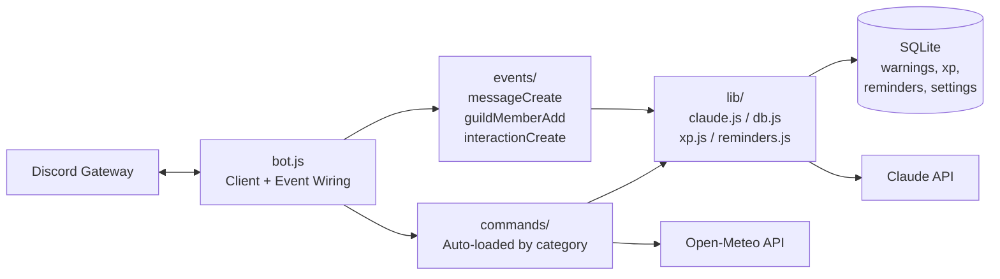

# Discord AI Bot

[](https://opensource.org/licenses/MIT)
[](https://nodejs.org/)
[](https://discord.js.org/)
[](https://www.anthropic.com/)
[](#features)

A production-ready Discord bot built with **Node.js**, **discord.js v14**, **SQLite**, and the **Claude API** — featuring AI-powered commands, persistent moderation tools, an XP/leveling system, button-based polls, persistent reminders, weather lookup, and auto-moderation.

## Highlights

- **27 slash commands** across 7 categories (AI, moderation, info, fun, utility, leveling, meta)
- **Persistent SQLite storage** with prepared statements — survives restarts cleanly
- **Auto-loading command and event architecture** — drop a file in a category folder, restart, it just works
- **Live button-based polls** with real-time vote tallies in the embed
- **XP system** with cooldowns, level math, and rank tracking
- **Persistent reminders** fired by a 15s scheduler tick
- **Anti-spam auto-moderation** — detects message-flooding and auto-mutes
- **Configurable welcome messages** per server
- **Hierarchical permission checks** that respect Discord's role hierarchy

## Architecture



## Features

### 🤖 AI (powered by Claude)
| Command | Description |
|---|---|
| `/ask <question>` | Ask Claude anything in chat |
| `/summarize <count>` | Summarize the last N messages |
| `/translate <text> <language>` | Translate text into any language |
| `/tldr <text>` | Compress long text into one or two sentences |
| `/roast <user>` | Generate a playful, lighthearted roast |

### 🛡️ Moderation
| Command | Description |
|---|---|
| `/kick <user> [reason]` | Kick a member |
| `/ban <user> [reason] [delete_days]` | Ban with optional message purge |
| `/mute <user> <minutes> [reason]` | Timeout a member |
| `/warn <user> <reason>` | Issue a warning (persisted in SQLite) |
| `/warnings <user>` | View a member's warning history |
| `/clear <count> [user]` | Bulk delete up to 100 messages |
| `/slowmode <seconds>` | Set channel slowmode |
| `/role <add\|remove> <user> <role>` | Manage roles |
| `/setwelcome <channel> [message]` | Configure welcome messages |

### 📊 Info
| Command | Description |
|---|---|
| `/serverinfo` | Server overview embed |
| `/userinfo [user]` | Member details + roles |
| `/avatar [user]` | Full-size avatar |

### 🎉 Fun
| Command | Description |
|---|---|
| `/8ball <question>` | Magic 8-ball |
| `/coinflip` | Flip a coin |
| `/poll <question> <options>` | Live button-voting polls |

### 🔧 Utility
| Command | Description |
|---|---|
| `/remind <when> <message>` | Persistent reminders (`10m`, `2h`, `1d`) |
| `/color <hex>` | Preview a hex color with RGB |
| `/weather <city>` | Current weather (Open-Meteo) |
| `/math <expression>` | Evaluate math expressions |

### 🏆 Leveling
| Command | Description |
|---|---|
| `/rank [user]` | Level, XP, progress bar |
| `/leaderboard` | Top 10 members |

### 🚨 Background systems
- **Anti-spam** — Auto-mutes users sending 5 identical messages in 10 seconds
- **Welcome messages** — Configurable greeting embeds for new members
- **Persistent reminders** — Stored in SQLite, fired by a 15-second tick scheduler
- **Auto-loading** — Commands and events are discovered at boot from their category folders

## Tech stack

| Layer | Choice | Why |
|---|---|---|
| Runtime | Node.js 18+ | Native `fetch`, ESM modules |
| Discord client | `discord.js` v14 | Industry standard, full slash + button support |
| AI | `@anthropic-ai/sdk` (Claude Sonnet 4.6) | Modern long-context model |
| Database | `better-sqlite3` | Synchronous, fast, no async overhead, no separate server |
| Math eval | `mathjs` | Safe expression evaluation |
| Weather | Open-Meteo API | Free, no API key |
| Config | `dotenv` | Standard env var loader |

## Why this project?

Most beginner Discord bots stop at "hello world + a few commands." This one is structured the way I'd build a small production service:

- **Separation of concerns** — `lib/` handles persistence, math, and external APIs; `commands/` is pure Discord interaction logic; `events/` handles passive flows.
- **Auto-discovery instead of hard-coded imports** — adding a new command is a single file in a category folder; no central registry to update.
- **Prepared SQL statements** — every database call is a parameterized prepared statement, eliminating an entire class of injection bugs and keeping per-query cost minimal.
- **Permission-aware design** — moderation commands declare required permissions via `setDefaultMemberPermissions`, and runtime checks respect Discord's role hierarchy so the bot can't act above itself.
- **Graceful shutdown** — `SIGINT`/`SIGTERM` handlers stop the reminder scheduler and cleanly destroy the client.

## Project structure

```
discord-ai-bot/
├── src/
│   ├── bot.js                  # Client setup, event wiring, scheduler boot
│   ├── deploy-commands.js      # Registers slash commands with Discord
│   ├── lib/
│   │   ├── claude.js           # Anthropic API wrapper
│   │   ├── db.js               # SQLite schema + prepared statements
│   │   ├── xp.js               # XP / level math + cooldown logic
│   │   └── reminders.js        # Reminder scheduler + duration parser
│   ├── commands/
│   │   ├── ai/                 # /ask, /summarize, /translate, /tldr, /roast
│   │   ├── moderation/         # /kick, /ban, /mute, /warn, /warnings, /clear, /slowmode, /role, /setwelcome
│   │   ├── info/               # /serverinfo, /userinfo, /avatar
│   │   ├── fun/                # /8ball, /coinflip, /poll
│   │   ├── utility/            # /remind, /color, /weather, /math
│   │   ├── leveling/           # /rank, /leaderboard
│   │   ├── help.js             # Categorized help embed
│   │   └── index.js            # Auto-loader
│   └── events/
│       ├── messageCreate.js    # XP awarding + anti-spam
│       ├── guildMemberAdd.js   # Welcome messages
│       ├── interactionCreate.js # Slash + button routing
│       └── index.js
├── .env.example
├── .gitignore
├── package.json
└── README.md
```

`data/bot.db` is created automatically at first run (gitignored).

## Setup

### 1. Create a Discord application

1. Go to https://discord.com/developers/applications → **New Application**
2. Under **Bot** → **Reset Token** → copy this as `DISCORD_TOKEN`
3. Under **General Information** → copy **Application ID** as `DISCORD_CLIENT_ID`
4. Under **Bot → Privileged Gateway Intents**, enable **Server Members Intent** and **Message Content Intent**

### 2. Invite the bot

Replace `YOUR_CLIENT_ID` and visit:

```
https://discord.com/oauth2/authorize?client_id=YOUR_CLIENT_ID&permissions=1374658854006&scope=bot+applications.commands
```

Permissions granted: Kick, Ban, Moderate, Manage Roles, Manage Messages, Manage Channels, Read/Send Messages, Embed Links.

### 3. Get an Anthropic API key

Sign up at https://console.anthropic.com → **API Keys** → Create.

### 4. Configure and run

```bash
cp .env.example .env
# Fill in DISCORD_TOKEN, DISCORD_CLIENT_ID, ANTHROPIC_API_KEY

npm install
npm run deploy   # registers slash commands (re-run after adding commands)
npm start        # boots the bot
```

Expected output:

```
Logged in as <bot name>
Loaded 27 commands across 7 categories
Serving N guild(s)
```

## Deployment to Railway

1. Push to GitHub.
2. Sign in at https://railway.app → **New Project → Deploy from GitHub repo**.
3. Add the three environment variables.
4. Railway auto-runs `npm start`.
5. After the first deploy, run `npm run deploy` once locally (or as a one-shot Railway shell command) to register slash commands.

## Notes

- Slash commands take up to 60 minutes to propagate globally on first registration. For instant testing, register per-guild via `Routes.applicationGuildCommands`.
- The XP system rewards 15 XP per message with a 60-second cooldown to prevent farming.
- Anti-spam triggers after 5 identical messages within 10 seconds; offenders are auto-muted for 5 minutes.
- All persistent state (warnings, XP, reminders, settings) lives in `data/bot.db` — back this file up if you care about retaining data.

## License

[MIT](LICENSE)
